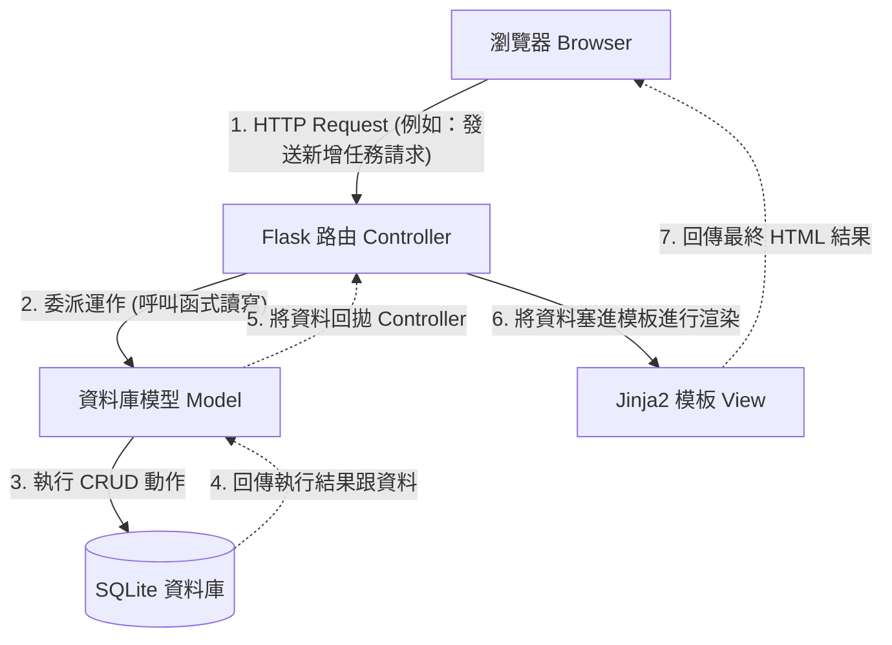

# 待辦事項管理系統 (To-Do List) 系統架構文件

本文件依據 PRD 需求，說明待辦事項管理系統的系統架構、技術選型與資料夾結構。這份文件可作為開發人員實作與溝通的藍圖。

## 1. 技術架構說明

為了符合輕量化與快速開發的目標，我們選擇了以下技術堆疊：

- **後端框架**：**Python + Flask**
  - **原因**：Flask 是一個輕量且彈性的 Python 網站框架，非常適合用來開發單純的待辦事項應用程式。它的學習曲線平緩，能快速建立起各項功能路由。
- **模板引擎**：**Jinja2**
  - **原因**：與 Flask 完美整合，負責在伺服器端將動態資料（如待辦事項清單）渲染到 HTML 畫面上。專案不需要實作複雜的前後端分離架構，頁面由後端一次產生。
- **資料庫**：**SQLite**
  - **原因**：SQLite 是內建的輕便資料庫，不需要額外架設資料庫伺服器（免安裝、免設定）。資料直接存放在檔案中，對中小型專案非常友善，我們也將透過參數化查詢或輕量級 ORM 來預防 SQL Injection 攻擊。

### Flask MVC 模式說明

我們採用經典的 **MVC (Model-View-Controller)** 設計模式來切分系統的各項職責：

- **Model（模型）**：負責「資料與規則」。處理與 SQLite 資料庫的存取操作，包含讀取清單、新增、修改狀態、刪除任務等與資料庫交握的邏輯。
- **View（視圖）**：負責「畫面呈現」。由 Jinja2 模板擔任，負責將取得的資料轉化成符合要求（包含基礎 RWD 佈局）的 HTML 使用者介面。
- **Controller（控制器）**：負責「溝通橋樑」。在 Flask 中對應於「路由 (Routes)」函式，負責接收來自瀏覽器的網路請求，分析需求並呼叫對應的 Model，最後指定哪個 View 模板負責渲染回應。

## 2. 專案資料夾結構

本專案將採取清晰懂的模組化結構，將不同職責的檔案分開管理：

```text
web_app_development/
├── app/                        # 應用程式的主程式資料夾
│   ├── models/                 # [Model] 資料庫模型與資料庫相關邏輯
│   │   └── task_model.py       # 定義任務的結構與 CRUD 存取邏輯
│   ├── routes/                 # [Controller] Flask 路由控制
│   │   └── task_routes.py      # 處理新增、刪除、及完成任務等 HTTP 請求
│   ├── templates/              # [View] Jinja2 HTML 模板檔
│   │   ├── base.html           # 共同的網頁基本骨架（引入共用的 CSS/JS 等）
│   │   └── index.html          # 首頁視圖（顯示任務列表與輸入表單）
│   └── static/                 # CSS / JS 及圖片等靜態網路資源
│       ├── css/
│       │   └── style.css       # 全站的主要樣式表
│       └── js/
│           └── script.js       # 處理部分前端基本互動的 JavaScript
├── instance/                   # 存放機密設定或本地資料庫，通常不加入進版控
│   └── database.db             # 實際的 SQLite 資料庫檔案
├── docs/                       # 專案文件區
│   ├── PRD.md                  # 產品需求文件
│   └── ARCHITECTURE.md         # 系統架構文件（本文）
├── app.py                      # 程式的整體啟動點（入口）
└── requirements.txt            # 列出開發及運行時所需的 Python 依賴套件清單
```

## 3. 元件關係圖

以下圖示表達當使用者在瀏覽網站時，系統內部元件如何互相傳遞資料與回應：



## 4. 關鍵設計決策

以下為在建構系統時，依據 PRD 所作的幾項重要設計決策：

1. **不做前後端分離（採用 SSR）**
   - **原因**：就待辦事項系統 (To-Do List) 而言，本案的 MVP 範圍內並不包含極複雜的單頁互動操作。採用傳統 Flask + Jinja2 伺服器端渲染，可以大幅度降減專案複雜度與開發時程。這也是最適合初學者理解的方式。

2. **選用輕量級的 SQLite 檔案資料庫**
   - **原因**：相比維護 MySQL 或 PostgreSQL 的環境建立，採用免安裝的檔案型 SQLite 能讓開發者更順暢地在本地開發跟部署。對於目標僅是個人日常事項紀錄的應用，其儲存空間與效能已足夠應付。

3. **清楚拆分 Routes 與 Models 的資夾結構**
   - **原因**：雖然這個應用非常小型，也可以全部塞到單一 `app.py` 中，但將 MVC 架構確實實行在資料夾切分，能為專案帶來更高的可維護性。未來若決定擴增「任務分類」甚至「會員功能」時，才不會令入口檔案過於龐大凌亂。

4. **採用 PRG 模式 (Post/Redirect/Get) 處理表單**
   - **原因**：使用者送出「新增代辦事項」或「標記完成任務」表單後，為了避免因為瀏覽器重新整理 (F5) 導致「重新傳送表單結果」產生重複資料，後端接收新增指令後將會「重新導向」(Redirect) 至單純顯示資料的頁面 (Get Request)。這是實作表單的最佳實踐。
