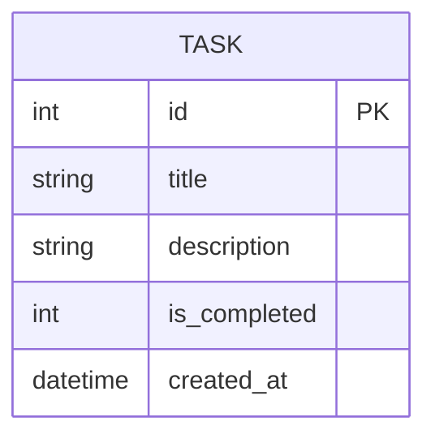

# 資料庫設計文件 (Database Design)

本文件依據 PRD 與系統架構文件，定義待辦事項系統的 SQLite 資料庫 Schema。

## 1. ER 圖（實體關係圖）



## 2. 資料表詳細說明

### `tasks` 資料表
負責儲存使用者的待辦事項。

| 欄位名稱 | 型別 | 必填 | 預設值 | 說明 |
| --- | --- | --- | --- | --- |
| `id` | INTEGER | 是 | 自動遞增 | Primary Key，任務的唯一識別碼 |
| `title` | TEXT | 是 | - | 任務標題 |
| `description` | TEXT | 否 | NULL | 任務詳細內容或備註 |
| `is_completed` | INTEGER | 否 | 0 | 任務狀態，0 表示未完成，1 表示已完成 |
| `created_at` | DATETIME | 否 | CURRENT_TIMESTAMP | 任務建立的時間戳記 |

## 3. SQL 建表語法

建表語法請參考 `database/schema.sql`：

```sql
CREATE TABLE IF NOT EXISTS tasks (
    id INTEGER PRIMARY KEY AUTOINCREMENT,
    title TEXT NOT NULL,
    description TEXT,
    is_completed INTEGER DEFAULT 0,
    created_at DATETIME DEFAULT CURRENT_TIMESTAMP
);
```

## 4. Python Model 程式碼

我們使用內建的 `sqlite3` 模組來實作資料庫存取，對應的 Model 程式碼儲存於 `app/models/task_model.py`。
Model 提供了基礎的 CRUD 功能：
- `create_task(title, description)`
- `get_all_tasks()`
- `get_task_by_id(task_id)`
- `update_task(task_id, title, description)`
- `toggle_task_status(task_id)`
- `delete_task(task_id)`
