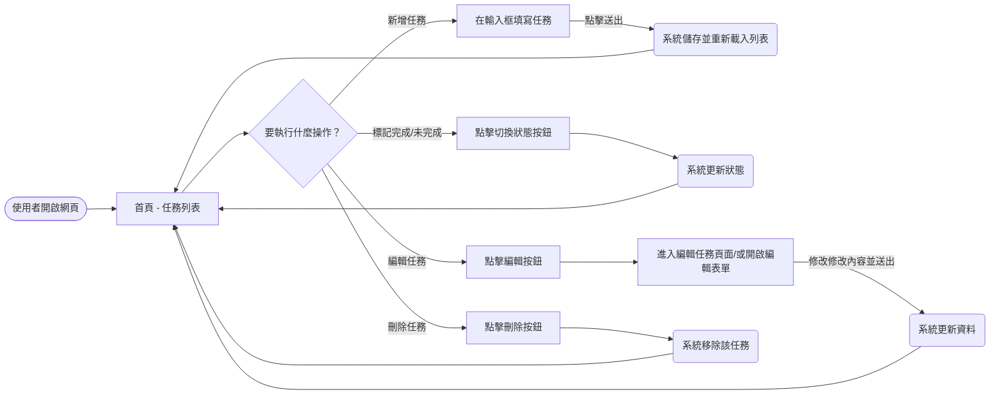
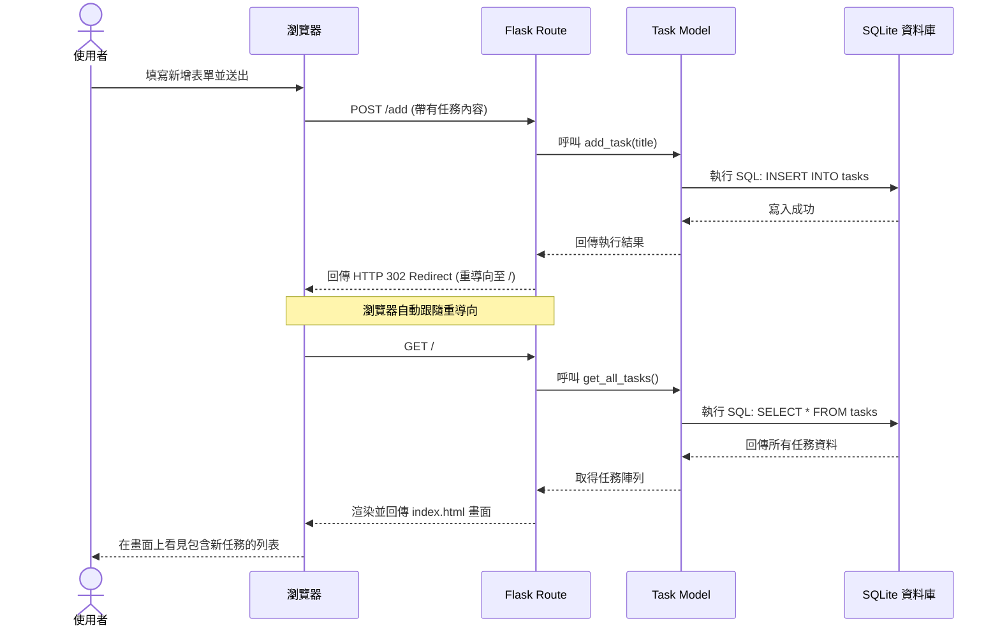

# 待辦事項管理系統流程圖與資料流

本文件依據 PRD 與架構設計文件，視覺化呈現使用者的操作流程、系統內部的資料行為流動，以及各項功能的路由規劃。

## 1. 使用者流程圖 (User Flow)

此流程圖描述使用者從進入系統開始，可能會進行的主要操作路徑與結果。

## 2. 系統序列圖 (Sequence Diagram)

以下以「新增任務」為例，展示 MVC 架構中「使用者、瀏覽器、Flask Controller、Model 與 SQLite 資料庫」之間的交握順序（採用 PRG 模式）：

## 3. 功能清單對照表

本表格列出系統主要的核心功能、對應的 URL 路徑，以及所採用的 HTTP 請求方法。
為確保瀏覽器表單的高相容性與使用者體驗，凡是涉及修改資料（建立、更新、刪除）的操作皆採用 `POST` 方法，並在執行完畢後重新導向回首頁。

| 功能名稱 | 功能說明 | HTTP 方法 | URL 路徑 |
| --- | --- | --- | --- |
| **顯示任務列表** | 首頁，查詢並顯示所有任務 | `GET` | `/` |
| **新增任務** | 接收表單內容並建立新任務 | `POST` | `/add` |
| **檢視編輯介面** | 顯示單一任務的編輯表單畫面 | `GET` | `/edit/<int:task_id>` |
| **儲存編輯內容** | 儲存修改過後的單一任務內容 | `POST` | `/edit/<int:task_id>` |
| **標記任務完成** | 切換單一任務為已完成（或未完成）狀態 | `POST` | `/complete/<int:task_id>` |
| **刪除任務** | 從系統中永久移除單一任務 | `POST` | `/delete/<int:task_id>` |
